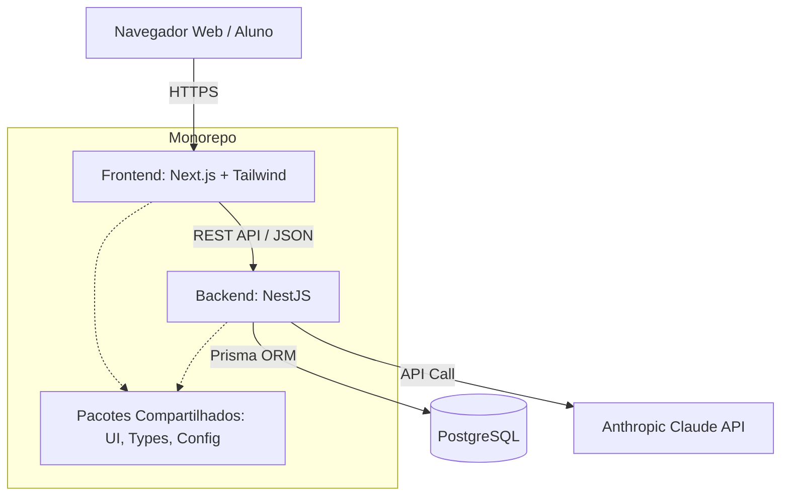
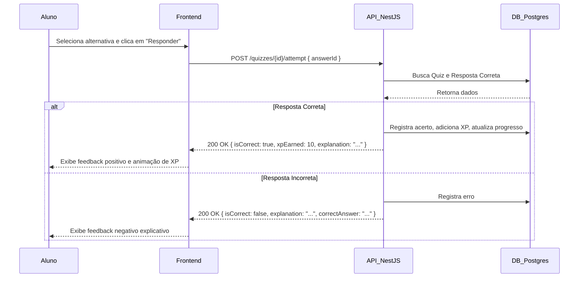

# Arquitetura do Sistema: Suporte Tech 30 Dias

Este documento descreve a arquitetura de software, o fluxo de dados e os padrões de projeto adotados para a plataforma.

## Visão Geral da Arquitetura

O sistema adota uma arquitetura baseada em **Microservices / Modular Monolith** utilizando um monorepo (Turborepo ou similar), separando claramente as responsabilidades entre o Frontend (Web) e o Backend (API).

### Diagrama de Arquitetura (Mermaid)

## Componentes Principais

### 1. Frontend (Next.js)
Responsável por toda a interface de usuário, SSR (Server-Side Rendering) quando necessário para SEO, e SSG (Static Site Generation) para páginas de conteúdo estático.
- **Gerenciamento de Estado:** React Context / Zustand.
- **Comunicação com API:** Axios ou React Query.
- **Autenticação:** NextAuth.js comunicando-se com o backend.

### 2. Backend (NestJS)
API RESTful que concentra toda a regra de negócio. Estruturado em módulos focados em domínios (Domain-Driven Design básico).
- **Módulos:** Auth, Users, Courses, Lessons, Quizzes, Progress, Gamification, AI Assistant.
- **Validação:** class-validator e DTOs.
- **Segurança:** JWT, Rate Limiting (especialmente para rotas da IA).

### 3. Banco de Dados (PostgreSQL + Prisma)
Banco de dados relacional para garantir integridade transacional, especialmente no progresso e gamificação.

### Diagrama de Fluxo de Dados: Responder Quiz

## Estrutura de APIs (REST)

A API seguirá os princípios RESTful. Abaixo estão os principais endpoints projetados:

### Autenticação & Usuários
- `POST /api/auth/register` - Cadastra novo usuário.
- `POST /api/auth/login` - Autentica usuário e retorna token.
- `GET /api/users/me` - Retorna perfil, XP e progresso geral.

### Cursos & Aulas
- `GET /api/courses` - Lista a trilha principal.
- `GET /api/courses/{id}/modules` - Lista módulos (semanas).
- `GET /api/modules/{id}/lessons` - Lista aulas do módulo.
- `GET /api/lessons/{id}` - Retorna detalhes da aula.
- `POST /api/lessons/{id}/complete` - Marca aula como concluída.

### Quizzes
- `GET /api/lessons/{id}/quiz` - Retorna o quiz da aula.
- `POST /api/quizzes/{id}/attempt` - Submete resposta e retorna feedback.

### IA & Assistente
- `POST /api/ai-assistant/ask` - Envia pergunta para a IA, incluindo contexto da aula atual.

## Padrões de Projeto Adotados

1. **Repository Pattern:** Abstraído através do Prisma, mas as regras de negócio ficam nos *Services* do NestJS.
2. **DTOs (Data Transfer Objects):** Para tipagem rigorosa de entrada e saída de dados.
3. **Guards & Interceptors (NestJS):** Para controle de acesso (RBAC) e formatação padronizada de respostas/erros.
4. **Atomic Design (Frontend):** Componentes divididos em Atoms, Molecules, Organisms, Templates e Pages.
